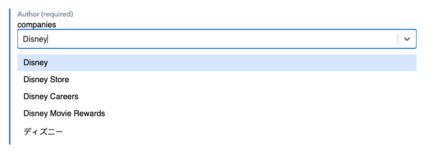

# Company Selector Contentful UI Extension

Contentful UI Extension to get company information from Clearbit _free autocomplete API_



## How it Works
This UI extension uses `React` under the hood. It will create a dropdown field using `react-select` and connects it to [Clearbit free automcomplete API](https://clearbit.com/docs#autocomplete-api). Providing the user a with an easy to interact field with autocomplete to select a company from it. 

## Description
_You must deploy this application on your own. It exceeds the limits from Contentful so it requires to be self-hosted. This can be done easily with services like [now](https://zeit.co/) from zeit_

Follow the instruction on how to upload your own extension [here](https://www.contentful.com/developers/docs/extensibility/ui-extensions/hosting/).

## How to enable it
To enable the extension go to a content type of your choice and add a new field of type `Text`. In the appearance panel you can then find the **Clearbit company selector extension**.

## Dev Setup
Clone this project.
Install dependencies by running `yarn`.
Configure an `.env` file:

```
SPACE_ID={space id from contentful admin}
CONTENTFUL_MANAGEMENT_ACCESS_TOKEN={management token from contentful admin}
```
### Styling
Use styles provided by `https://contentful.github.io/ui-extensions-sdk/cf-extension.css`

## Available commands

- `yarn start` - Start server in development mode for local development
- `yarn build` - Builds deployable UI extension
- `yarn deploy` - Deploys extension to Contentful
